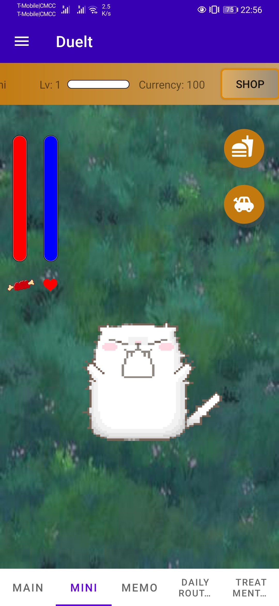
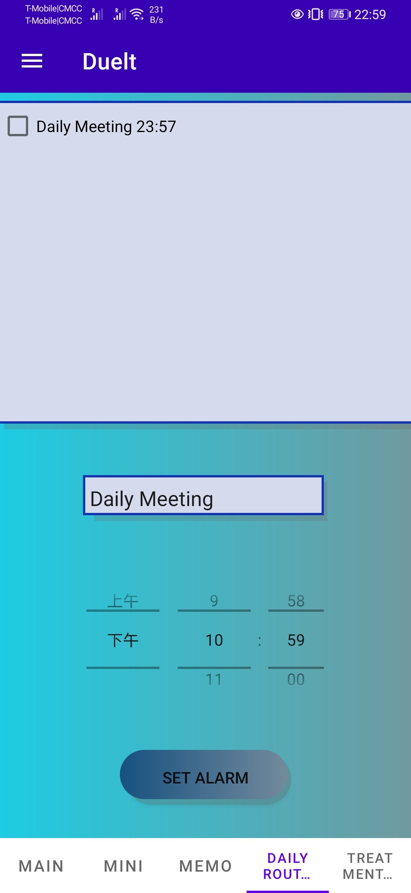
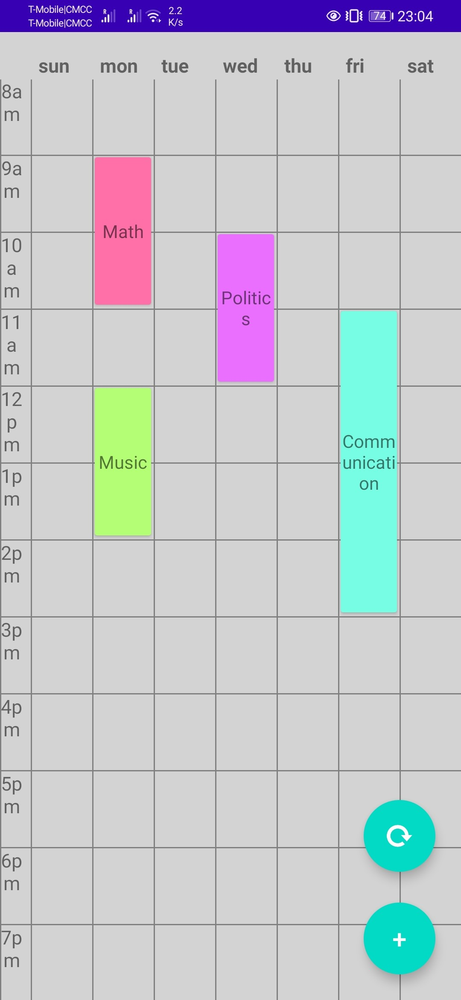
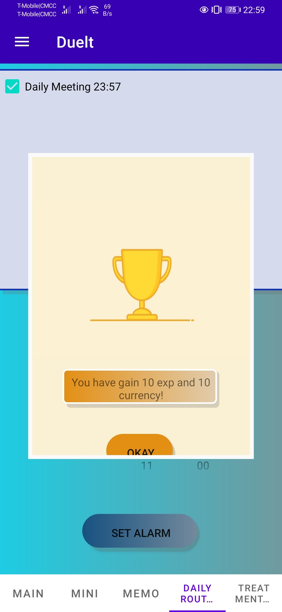

# DueItProject

### Project Description:

> Due It is a productive To-Do list, memo, and task management Android App aim to help users overcome procrastination, be efficient and focused, organize tasks, and record upcoming events.  
> 
> Due It has a pet system. To motivate users, rewards are given after completing each tasks. Rewards are used as the currency in the pet system.  

## Main Features include:

*   Pet system.
*   Pomodoro countdown.
*   Create daily routine list.
*   Create events reminder list.
*   Make weekly schedule
*   Comming Soon

## Project Year:   
> Mar 2021 - May 2021

## Tools And Technologies:  
> Android Studio, XML, JAVA, MySQL

## Installation Instructions:   
> Install "dueit.apk" from an Android Mobile Phone.

## Team:

- HaoLin Chen - Database design, UI Programming, Dev

- Zejun Ren - UI Programming, Dev

- JunQuan Wu - UI Programming, Dev

- Romer Chia - UI Programming, Dev

## Repository Link:   
> [https://github.com/Haolinc/DueItProject](https://github.com/Haolinc/DueItProject)

### App Screenshots:    

